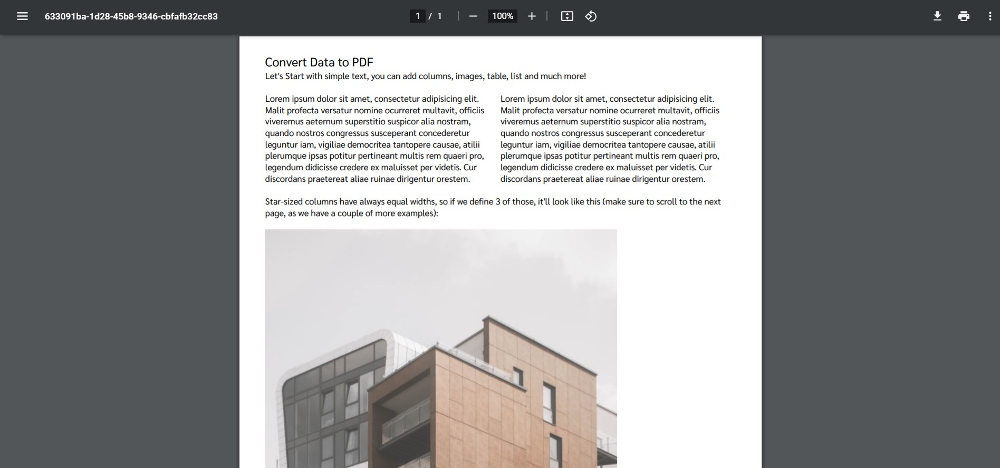

# Create PDF file from data
You can easily create pdf file by using pdfmake library. You can visit the [pdfmake official website](https://pdfmake.github.io/docs/0.1/) to get more information.



## Technologies


## Setup
1. Create folder
2. Run `npm init` and set entry point/main to index.html
3. Run `npm install pdfmake` to install pdfmake library
4. Create examples/fonts in node_module/pdfmake
5. You can put your desired font in examples/fonts.
6. In /node_modules/pdfmake run `node build-vfs.js ./examples/fonts` to keep font in vfs_fonts.js which enable you to use your own font.
7. Finish setup
8. In index.html at the head tag, include script tag to import pdfmake in the project.
    ```javascript
    <head>
        ...
        <script src='node_modules/pdfmake/build/pdfmake.min.js'></script>
        <script src='node_modules/pdfmake/build/vfs_fonts.js'></script>
    </head>
    ```
9. finish setup